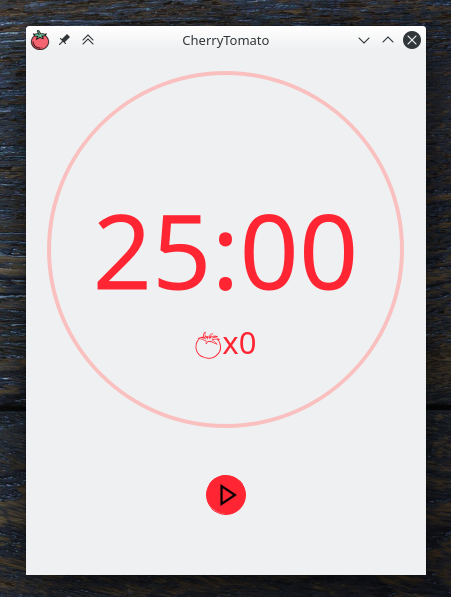

[](https://codecov.io/gh/yakimka/CherryTomato)

# CherryTomato



## Features

* Easy to use, flexible Pomodoro Technique timer.
* Configurable intervals.
* Notification after time is over.
* Short and long break (after n tomatoes).
* Auto stop tomato and break.
* Tomatoes counter.
* Switch to tomato when user press stop.
* Execute custom commands when the timer is started, stopped or changed state.

## Requirements

* Python>=3.6
* PyQt5

## Tested on

* Arch Linux
* KDE5
* Xorg X server
* FullHD Display
* Python 3.7, 3.8

## Installing

CherryTomato can be used without installation (by executing `main.py`). However, you can install it.

`python3 setup.py install`

### Arch Linux

Also you can install [CherryTomato from AUR](https://aur.archlinux.org/packages/cherrytomato):

`yaourt -S cherrytomato`

## Execute custom commands

You can specify custom commands that will be triggered on some events like the timer is started, stopped or changed state.

Commands executed with python `subprocess.Popen` without `shell=True` option. It means that you can't use pipes or redirect output. You can read more about this in [subprocess documentation](https://docs.python.org/3/library/subprocess.html#subprocess.Popen).

But if you need pipes and other shell features you can write your own script, place it in filesystem and execute from CherryTomato.

**NOTE:** Processes started by commands that you executed will not be closed automatically on the CherryTomato exit.
 
Also, you can pass some info about timer to your custom commands with macros:

* `{tomatoes}` - number of completed tomatoes
* `{state}` - current timer state ("tomato", "break" or "long_break")

Examples you can see on screenshot.

`/opt/scripts/test.sh` from screenshot example:

```shell script
#!/bin/bash

tomatoes=$1
state=$2

if [ $tomatoes -gt 10 ]
then
    # ...
    # greater than 10 logic
    # ...
else
    # ...
    # lesser than 10 logic
    # ...
fi


if [ $state = "tomato" ]
then
    # ...
    # is tomato state logic
    # ...
elif [ $state = "break" ]
then
    # ...
    # is break state logic
    # ...
elif [ $state = "long_break" ]
then
    # ...
    # is long break state logic
    # ...
fi
```

Another example - you can simply play and pause music on Spotify with commands:

`dbus-send --print-reply --dest=org.mpris.MediaPlayer2.spotify /org/mpris/MediaPlayer2 org.mpris.MediaPlayer2.Player.Play`

`dbus-send --print-reply --dest=org.mpris.MediaPlayer2.spotify /org/mpris/MediaPlayer2 org.mpris.MediaPlayer2.Player.Pause`

## Credits

* Icons made by [Freepik](https://www.flaticon.com/authors/freepik) from [www.flaticon.com](www.flaticon.com)
* [Notification sound](https://freesound.org/people/rhodesmas/sounds/342755/) by rhodesmas is licensed under CC BY 3.0  
